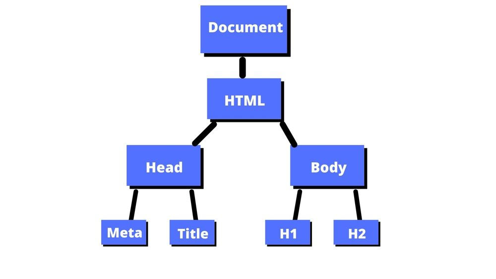

<div align="center">

[**_``Go Back``_**](../README.md)

# JavaScript

</div>

## Introduction

``JavaScript`` is a lightweight, cross-platform, and interpreted scripting language used to make webpages interactive (e.g., having complex animations, clickable buttons, popup menus, etc.). It is well-known for the development of web pages, many non-browser environments also use it. JavaScript can be used for ``Client-side`` developments as well as ``Server-side`` developments. JavaScript contains a standard library of objects, like ``Array``, ``Date``, and ``Math``, and a core set of language elements like ``operators``, ``control structures``, and ``statements``. 

* **``Client-side:``** It supplies objects to control a browser and its ``Document Object Model (DOM)``. Like if client-side extensions allow an application to place elements on an HTML form and respond to user events such as ``mouse clicks``, ``form input``, and ``page navigation``. Useful libraries for the client-side are ``AngularJS``, ``ReactJS``, ``VueJS`` and so many others.
    
* **``Server-side:``** It supplies objects relevant to running JavaScript on a server. Like if the server-side extensions allow an application to communicate with a database, and provide continuity of information from one invocation to another of the application, or perform file manipulations on a server. The useful framework which is the most famous these days is ``node.js``.

## Need of Client Side Scripting Language

Using a client-side script for interactivity in a Web application usually provides the appearance of better performance than using a server-side script to implement the same functionality because the client-side script does not incur the delay of a round trip between the client and the server, making the Web application more responsive. This is crucial for a dynamic user experience in a Web application. As an extreme example, imagine that a developer wants to limit input to a text box to only numbers. Each time the user hits a key, the character entered must be examined and thrown away if it's not a number or cursor movement key. Imagine the delay if the application had to wait for a round trip between the client and server and redraw the page for each keystroke. Obviously, such a feature would never be practical in a Web application if it were not for client-side scripting. Client-side scripting allows many features to be easily incorporated in Web applications that would otherwise be impractical.

In addition, client-side scripting offers the benefit of off-loading part of the computational demands of an application from the server to the client. The client-side computer is usually wasting most of its processing potential, idly waiting for the user to do something. Web servers, on the other hand, are usually taxed to their limit, serving hundreds or thousands of concurrent users.

The two main benefits of client-side scripting are:

* The user’s actions will result in an immediate response because they don’t require a trip to the server.
* Fewer resources are used and needed on the web-server.

## Formatting and Coding Convetions

Coding conventions are **style guidelines for programming**. They typically cover:

* Naming and declaration rules for variables and functions.
* Rules for the use of white space, indentation, and comments.
* Programming practices and principles.

Coding conventions secure quality:

* Improves code readability.
* Make code maintenance easier.

### **Variable Names**

The name of a variable must begin with a letter and ``camelCase`` is used to initialize variables or functions which means the first letter should be a small letter and if another word is added after the first word then the first letter of that word should be capitalized.

```JS
let fullName = "Prashant Bhandari";
```

### **Indentation and function**

JavaScript coding conventions say that use two spaces to indent JavaScript code, and never use trailing whitespaces. For functions, use ``camelCase`` and to define a function use the keyword function:

```JS
function myFunc(){
  let x=0;
}
```

### **Spaces, all brackets**

Always leave spaces between operators such as ``(= + – * /)`` and ``commas``:

```JS
let name = fName + lName;
const myArray = ["cat", "mouse", "dog"];
```

### **Object guidelines**

For using objects, the coding standards include the following points:

* The starting bracket should be placed on the same line as the object name.
* Between an object’s property and its value is a colon and a space.
* String values are covered with double quotations.
* Numeric values are simply written and quotes are not used.
* A comma is used after every property value pair except the last one
* After the object closing bracket, add a semicolon.
* Objects that have fewer properties can be compressed and written on the same line by having spaces between properties.

```JS
let person = {
  firstName: "Jackie",
  lastName: "Chan",
};
//can also be written in compress form
let person = {firstName:"Jackie", lastName:"Chan"};
```

### **Statement Guidelines**

A simple statement like initializing a variable that ends on a single line should have a semicolon at the end of the line:

```JS
let name = "Jackie Chan";
```

For a compound sentence, leave a space and place an opening bracket after which then fill in the rest of the sentences in that opening bracket. Once all the statements are finished, put a closing bracket. It should be noted that in a compound sentence we don’t put a semicolon at the end of it:

```JS
for (i = 0; i < 3; i++) {
  a *= i;
}
```

### **Line Length**

Standard coding and conventions say that lines length greater than 80 should be written on another line by breaking the original line so that the code becomes more readable:

```JS
document.getElementById("example").innerHTML =
"Example!";
```
### **File Extensions**

Javascript coding standards and conventions say that the ``HTML`` file should have a ``.html`` extension, the ``CSS`` file should have a ``.css`` extension and the ``Javascript`` file should have a ``.js`` extension.

### **Loops and Conditions**

After a control statement’s identification, and after every comma use whitespace. The conditional statements coding conventions and standards code is given below:

```JS
if (condition1 || condition2) {
  // some statements
}
else if (condition3 && condition4) {
  // some other statements
}
else {
  // default statements
}
```

For loop follow the below code:

```JS
for (let i = 0; i < 5; i++) {
  x += i;
}
```

### **Comments**

Block comments are avoided according to coding standards and conventions and line comments are used. Comments are put in the left margin and ``//`` are put in the start.

```JS
// an example
let name = "Ram";
```

## JavaScript Files

A JavaScript file is a text file containing ``JavaScript`` code that is used to execute JavaScript instructions in webpages. It may include functions that open and close windows, validate form fields, enable rollover images, or create dropdown menus.JavaScript file must be saved by ``.js`` extension.

## Comments

JavaScript comments can be used to explain JavaScript code, and to make it more readable. JavaScript comments can also be used to prevent execution, when testing alternative code.

### **Single Line Comments**

Single line comments start with ``//``.

Any text between ``//`` and the end of the line will be ignored by JavaScript (will not be executed).

This example uses a single-line comment before each code line:

```JS
// Change heading:
document.getElementById("myH").innerHTML = "My First Page";
// Change paragraph:
document.getElementById("myP").innerHTML = "My first paragraph.";
```

### **Multi-line Comments**

Multi-line comments start with ``/*`` and end with ``*/``.

Any text between ``/*`` and ``*/`` will be ignored by JavaScript.

This example uses a multi-line comment (a comment block) to explain the code:

```JS
/*-------------------------------
The code below will change
the heading with id = "myH"
and the paragraph with id = "myP"
in my web page:
-------------------------------*/
document.getElementById("myH").innerHTML = "My First Page";
document.getElementById("myP").innerHTML = "My first paragraph.";
```

## Embedding JavaScript in HTML

JavaScript can be added to your HTML file in two ways:

* Internal JS
* External JS

### **Internal JS:** 

We can add JavaScript directly to our HTML file by writing the code inside the ``<script>`` tag. The ``<script>`` tag can either be placed inside the ``<head>`` or the ``<body>`` tag according to the requirement.

Syntax:

```HTML
<script>
    // JavaScript Code
</script>
```
Example:

```HTML 
<!DOCTYPE html>
<html lang="en">
<head>
    <title>Example</title>
</head>
<body>
    <script>
        console.log("This is JavaScript");
    </script>
</body>
</html>
```

### **External JS:** 

In order to accommodate larger scripts or scripts that will be used across several pages, JavaScript code generally lives in one or more js files that are referenced within HTML documents, similarly to how external assets like CSS are referenced.

The benefits of using a separate JavaScript file include:

* Separating the HTML markup and JavaScript code to make both more straightforward.
* Separate files makes maintenance easier.
* When JavaScript files are cached, pages load more quickly.

We can write JavaScript code in other file having an extension ``.js`` and then link this file inside the ``<head>`` tag of the HTML file in which we want to add this code.

How to link:

```HTML
<script src="js file path"></script>
```

Example:

Folder Structure

```
Example2
    ├──index.html
    └──js
        └── logic.js

```

**Content of ``index.html`` :**

```HTML
<!DOCTYPE html>
<html lang="en">
<head>
    <script src="js/logic.js"></script>
    <title>Example2</title>
</head>
<body>
    <script>
        printdate();
    </script>
</body>
</html>
```

**Content of ``logic.js`` :**

```JS
function printdate()
{
    let d = new Date();
    document.body.innerHTML = "<h1>Today's date is " + d + "</h1>";
}
```

## Using Script Tag

The ``<script>`` tag is used to embed a client-side script (JavaScript).

The ``<script>`` element either contains scripting statements, or it points to an external script file through the src attribute.

Example:

```HTML
<script>
document.getElementById("demo").innerHTML = "Hello JavaScript!";
</script>
```

## NoScript Tag


The ``<noscript>`` tag defines an alternate content to be displayed to users that have disabled scripts in their browser or have a browser that doesn't support script.

The ``<noscript>`` element can be used in both ``<head>`` and ``<body>``. When used inside ``<head>``, the ``<noscript>`` element could only contain ``<link>``, ``<style>``, and ``<meta>`` elements.

Example:

```HTML
<script>
document.write("Hello World!")
</script>
<noscript>Your browser does not support JavaScript!</noscript>
```

## Operators
Operators are the foundation of any programming language. Thus the functionality of any programming language is incomplete without the use of operators. We can define operators as symbols that help us to perform specific mathematical and logical computations on operands. In other words, we can say that an operator operates the operands.

For example, consider the below statement:

```JS
c = a + b;
```

Here, `` + ``  is the operator known as addition operator and ``a`` and ``b`` are operands. The addition operator tells the compiler to add both of the operands ``a`` and ``b``.
``JavaScript`` is rich in built-in operators and provides the following types of operators −

* Arithmetic Operator
* Relational Operator
* Logical Operator
* Assignment Operator
* Increment/decrement Operator
* Conditional Operator
* Bitwise Operator

### **Arithmetic Operator**
These are the operators used to perform arithmetic/mathematical operations on operands.

|Operator|       Meaning     | Example |
|:------:|-------------------|---------|
|    +   |      Addition     |  A + B  |
|    −   |    Subtraction    |  A − B  |
|    *   |  Multiplication   |  A * B  |
|    /   |      Division     |  B / A  |
|    %   |Modulus (remainder)|  B % A  |

### **Relational Operator**
These are used for comparison of the values of two operands. For example, checking if one operand is equal to the other operand or not, an operand is greater than the other operand or not etc.

|Operator|         Meaning            |Example|
|:------:|----------------------------|:-----:|
|   <    |is less than                |  a<b  |
|   <=   |is less than or equal to    | a<=b  |
|   >    |is greater than             |  a>b  |
|   >=   |is greater than or equal to | a>=b  |
|   ==   |is equal to                 | a==b  |
|   !=   |is not equal to             | a!=b  | 

### **Logical Operator**
Logical Operators are used to combine two or more conditions/constraints or to complement the evaluation of the original condition in consideration. The result of the operation of a logical operator is a boolean value either true or false.

|  Operator      |  Meaning                                               |   Example   |
|:--------------:|--------------------------------------------------------|:-----------:|
|  `&&`(AND)     |True only if both are True otherwise False              |   `a && b`  |
|  `∥`(OR)       |True if either of them are True ,False if all are false |   `a ∥ b`   |
|  `!`(NOT)      |False if it is True,True if it is false                 |     `!a`    |
 
### **Assignment Operator**
Assignment operators are used to assign value to a variable. The left side operand of the assignment operator is a variable and right side operand of the assignment operator is a value. The value on the right side must be of the same data-type of variable on the left side otherwise the compiler will raise an error.

|Operator|         Meaning                                                                        |                    Example                      |
|:------:|----------------------------------------------------------------------------------------|:-----------------------------------------------:|
|   =    |Simple assignment operator. Assigns values from right side operands to left side operand|  ``a = 10;``                                    |
|   +=   |This operator is combination of ‘+’ and ‘=’ operators                                   | ``(a += b)`` can be written as ``(a = a + b)``  |
|   -=   |This operator is combination of ‘+’ and ‘=’ operators                                   | ``(a -= b)`` can be written as ``(a = a - b)``  |
|   *=   |This operator is combination of ‘+’ and ‘=’ operators                                   | ``(a *= b)`` can be written as ``(a = a * b)``  |
|   /=   |This operator is combination of ‘+’ and ‘=’ operators                                   | ``(a /= b)`` can be written as ``(a = a / b)``  |

### **Increment/decrement Operator** 
In ``JavaScript``, the increment operator ``++`` increases the value of a variable by 1. Similarly, the decrement operator ``--`` decreases the value of a variable by 1.

### **Conditional Operator** 
The conditional operator is also known as a ternary operator. The conditional statements are the decision-making statements which depends upon the output of the expression. It is represented by two symbols, i.e., ``?`` and ``:``.

As conditional operator works on three operands, so it is also known as the ternary operator.

The behavior of the conditional operator is similar to the 'if-else' statement as 'if-else' statement is also a decision-making statement.

Syntax:
```JS
variable = <condition> ? <value1> : <value2>; 
```
It can be visualized into if-else statement as:  
```c
if(condition)
{
    variable = value1;
}
else
{
    variable = value2;
}
```
Example:

```JS
x = (a>b) ? a : b;
```
### **Bitwise Operator**
In arithmetic-logic unit (which is within the CPU), mathematical operations like: addition, subtraction, multiplication and division are done in bit-level. To perform bit-level operations in ``JavaScript``, bitwise operators are used.

<table style="width:100%">
  <tr>
    <th>Operators</th>
    <th>Meaning of operators</th>
  </tr>
  <tr>
    <td>&</td>
    <td>Bitwise AND</td>
  </tr>
  <tr>
    <td>|</td>
    <td>Bitwise OR</td>
  </tr>
   <tr>
    <td>^</td>
    <td>Bitwise XOR</td>
  </tr>
  <tr>
    <td>~</td>
    <td>Bitwise complement</td>
  </tr>
   <tr>
    <td><<</td>
    <td>Shift left</td>
  </tr>
  <tr>
    <td>>></td>
    <td>Shift right</td>
  </tr>
</table>


## Control Structures

Control structure actually controls the flow of execution of a program. Following are the several control structure supported by javascript.

* ``if`` … ``else``
* ``switch`` case
* ``for`` loop
* ``while`` loop
* ``do`` ``while`` loop

### ``if``

``if`` statement is the most simple decision making statement. It is used to decide whether a certain statement or block of statements will be executed or not i.e if a certain condition is true then a block of statement is executed otherwise not.

Syntax:

```JS
if (condition)
{ 
  Statement(s);
} 
```

Example:

```JS
let name = "Prashant";
if (name == "Prashant") 
{
  console.log("Your name is Prashant");
} 
```

### ``if-else``

The ``if`` statement alone tells us that if a condition is ``true`` it will execute a block of statements and if the condition is ``false`` it won’t. But what if we want to do something else if the condition is ``false``. Here comes the ``else`` statement. We can use the ``else`` statement with ``if`` statement to execute a block of code when the condition is ``false``.

Syntax:
```JS
if (condition)
{
  Statement(s);
}
else
{
  Statement(s);
}
```

Example:
```JS
let num = 45;
if (a > 0) 
{
  console.log(num+" is Positive Number");
} 
else 
{
  console.log(num+" is Negetive Number");
}
```
> The block of code following the else statement is executed as the condition present in the if statement is false.

### ``if-else-if``

Here, a user can decide among multiple options. The ``if`` statements are executed from the top down. As soon as one of the conditions controlling the ``if`` is ``true``, the statement associated with that ``if`` is executed, and the rest of the ``else-if`` ladder is bypassed. If none of the conditions are ``true``, then the final ``else`` statement will be executed.

Syntax:

```JS
if (condition)
{
    Statement(s);
}
else if (condition)
{
    Statement(s);
}
.
.
else
{
    Statement(s);
}
```

Example:

```JS
let a = 10; 
let b = 45;
if (a > b) 
{
  console.log(a+" is Greater");
} 
else if (b > a) 
{
  console.log(b+" is Greater");
} 
else 
{
  console.log("Both are Equal");
}
```

### ``switch`` case

The ``switch`` statement is used to perform different actions based on different conditions.

Syntax:

```JS
switch (Expression) 
{
  case (value 1):
  {
    Statements;
    break;
  }
  case (value 2):
  {
    Statements;
    break;
  }
    ...
  default:
  {
    Statements;
  }
}
```

Example:

```JS
let favcolor = "red";
switch (favcolor) 
{
  case ("red"):
  {
    console.log("Your favorite color is red!");
    break;
  }
  case ("blue"):
  {
    console.log("Your favorite color is blue!");
    break;
  }
  case ("green"):
  {
    console.log("Your favorite color is green!");
    break;
  }
  default:
  {
    console.log("Your favorite color is neither red, blue, nor green!");
  }
}
```

### ``for`` loop

The ``for`` loop is used when you know in advance how many times the script should run.

Syntax:

```JS
for (init counter; test counter; increment counter) 
{
  Statements;
} 
```

Example:

```JS
for (let x = 0; x <= 10; x++) 
{
  console.log("The number is: "+x);
}
```

### ``while`` loop

The ``while`` loop executes a block of code as long as the specified condition is true.

Syntax:

```JS
while (condition) 
{
  Statements;
}
```

Example:

```JS
let x = 1;
while (x <= 5) 
{
  console.log("The number is: "+x);
  x++;
}
```

### ``do`` ``while`` loop

The ``do...while`` loop - Loops through a block of code once, and then repeats the loop as long as the specified condition is true.The ``do...while`` loop will always execute the block of code once, it will then check the condition, and repeat the loop while the specified condition is true.

Syntax:

```JS
do 
{
  Statements;
} while (condition); 
```

Example:

```JS
let x = 1;
do
{
  console.log("The number is: "+x);
  x++;
} while (x <= 5);
```

## Array and For Each Loop

### **Array**

In JavaScript, array is a single variable that is used to store different elements. It is often used when we want to store list of elements and access them by a single variable. Unlike most languages where array is a reference to the multiple variable, in JavaScript array is a single variable that stores multiple elements.

#### Declaration of an Array : 

There are basically two ways to declare an array. 

* By array literal.
* By using an Array constructor (using new keyword).

##### **By array literal**

Using an array literal is the easiest way to create a JavaScript Array.

```JS
const array_name = [item1, item2, ...]; 
```
>It is a common practice to declare arrays with the ``const`` keyword.

```JS
// empty array
const myList = [];
// array of numbers
const numberArray = [ 2, 4, 6, 8];
// array of strings
const stringArray = [ 'eat', 'work', 'sleep'];
// array with mixed data types
const newData = ['work', 'exercise', 1, true]
```

You can also store arrays, functions and other objects inside an array. For example:

```JS
const newData = [
    {'task1': 'exercise'},
    [1, 2 ,3],
    function hello() { console.log('hello')}
];
```

##### **By using an Array constructor (using new keyword)**

You can also create an array using JavaScript's ``new`` keyword.

Syntax:

```JS
let arrayName = new Array();
let arrayName = new Array(Number length);
let arrayName = new Array(element1, element2, element3,... elementN);
```

Exampale:

```JS
// empty array
let arr1 = new Array();
//Creates an array of 5 undefined elements
let arr2 = new Array(5);
// Creates an array having elements 10, 20, 30, 40, 50
let arr3 = new Array(10, 20, 30, 40, 50);
```

#### Accessing Array Elements :
You can access elements of an array using indices ``(0, 1, 2 …)``. For example,

```JS
const myArray = ['h', 'e', 'l', 'l', 'o'];
// first element
console.log(myArray[0]);  // "h"
// second element
console.log(myArray[1]);  // "e"
```

#### Length property of an Array 
Length property of an Array returns the length of an Array. Length of an Array is always one more than the highest index of an Array. 

Example below illustrates the length property of an Array:

```JS
const arr=[234, 2323, 2323, 23, 232];
//len contains the length of the array
let len = arr.length;
for (let i = 0; i < len; i++)
{
  console.log(arr[i]);
}
```
### **For Each Loop**

The ``forEach()`` method calls a function for each element in an array.

The ``forEach()`` method is not executed for empty elements.

**Syntax:**

```JS
array.forEach(function(currentValue, index, arr), thisValue)
```

**Parameters:**

|                 |                                                                                          |
|:---------------:|------------------------------------------------------------------------------------------|
|``function()``   |  [Required] A function to run for each array element.                                    |
|``currentValue`` |  [Required] The value of the current element.                                            |
|``index``        |  [Optional] The index of the current element.                                            |
|``arr``          |  [Optional] The array of the current element.                                            |
|``thisValue``    |  [Optional] Default ``undefined``. A value passed to the function as its ``this`` value. |

**Example:**

```JS
function print(item, index) 
{
   console.log(index + ": " + item); 
}
const proglang = ["JavaScript", "PHP", "Python", "Java"];
proglang.forEach(print);
```

**Output:**

```
0: JavaScript
1: PHP
2: Python
3: Java
```

## Defining and Invoking Functions

JavaScript functions are **defined** with the ``function`` keyword.

You can use a function **declaration** or a function **expression**.

**Syntax:**

```JS
function functionName(arguments) 
{
  // code to be executed
  return(value);
}
```
**Example:**

```JS
function addNumbers(a,b) 
{
  let sum = a + b;
  return (sum);
}
```

>Semicolons are used to separate executable JavaScript statements. Since a function declaration is not an executable statement, it is not common to end it with a semicolon.

The code inside a JavaScript ``function`` will execute when "something" invokes it.

The code inside a function is not executed when the function is ``defined``.

The code inside a function is executed when the function is ``invoked``.

It is common to use the term ``"call a function"`` instead of ``"invoke a function"``.

**Example:**

```JS
function addNumbers(a,b) 
{
  let sum = a + b;
  return (sum);
}
let s = addNumbers(30,50); //Will retrurn 80 
console.log("Sum = "+s);
```

## Built in Objects

``Built-in objects`` are not related to any ``Window`` or ``DOM``. These objects are used for ``simple data processing`` in the ``JavaScript``.

Built in objects:

- ``Math Object``
- ``Date Object``
- ``String Object`` 
- ``Array Object`` 
- ``Boolean Object``
- ``Number Object`` 
- ``RegExp Object``

### ``Math Object``

- ``Math object`` is a built-in static object.
- It is used for performing complex math operations.

**Math Properties**

| Properties |             Description         |
|:----------:|---------------------------------|
|  SQRT2     | Returns square root of 2.       |
|  PI        | Returns ``Π`` value.            |
|  E \       | Returns Euler's Constant.       |
|  LN2       | Returns natural logarithm of 2. |
|  LN10      | Returns natural logarithm of 10.|
|  LOG2E     | Returns base 2 logarithm of E.  |
|  LOG10E    | Returns 10 logarithm of E.      |


**Math Methods**

| Properties |                           Description                               |
|:----------:|---------------------------------------------------------------------|
|``max(a,b)``| Returns largest of a and b                                          |
|``min(a,b)``| Returns least of a and b                                            |
|``round(a)``| Returns nearest integer                                             |
|``ceil(a)`` | Rounds up. Returns the smallest integer greater than or equal to a  |
|``floor(a)``| Rounds down. Returns the largest integer smaller than or equal to a |
|``exp(a)``  | Returns ea                                                          |
|``pow(a,b)``| Returns ab                                                          |
|``abs(a)``  | Returns absolute value of a                                         |
|``random()``| Returns a pseudo random number between 0 and 1                      |
|``sqrt(a)`` | Returns square root of a                                            |
|``sin(a)``  | Returns sin of a (a is in radians)                                  |
|``cos(a)``  | Returns cos of a (a is in radians)                                  |


### ``Date Object``

- ``Date`` is a data type.
- ``Date object`` manipulates ``date`` and ``time``.
- ``Date()`` constructor takes no arguments.
- ``Date object`` allows you to get and set the ``year``, ``month``, ``day``, ``hour``, ``minute``, ``second`` and ``millisecond`` fields.

**Syntax:**

```JS
let variable_name = new Date();
```

**Example:**

```JS
let current_date = new Date();
```

**Date Methods**

|      Properties       |                            Description                              |
|:---------------------:|---------------------------------------------------------------------|
|``Date()``             |Returns current date and time.                                       |
|``getDate()``          |Returns the day of the month.                                        |
|``getDay()``           |Returns the day of the week.                                         |
|``getFullYear()``      |Returns the year.                                                    |
|``getHours()``         |Returns the hour.                                                    |
|``getMinutes()``       |Returns the minutes.                                                 |
|``getSeconds()``       |Returns the seconds.                                                 |
|``getMilliseconds()``  |Returns the milliseconds.                                            |
|``getTime()``          |Returns the number of milliseconds since January 1, 1970 at 12:00 AM.|
|``getTimezoneOffset()``|Returns the timezone offset in minutes for the current locale.       |
|``getMonth()``         |Returns the month.                                                   |
|``setDate()``          |Sets the day of the month.                                           |
|``setFullYear()``      |Sets the full year.                                                  |
|``setHours()``         |Sets the hours.                                                      |
|``setMinutes()``       |Sets the minutes.                                                    |
|``setSeconds()``       |Sets the seconds.                                                    |
|``setMilliseconds()``  |Sets the milliseconds.                                               |
|``setTime()``          |Sets the number of milliseconds since January 1, 1970 at 12:00 AM.   |
|``setMonth()``         |Sets the month.                                                      |
|``toDateString()``     |Returns the date portion of the Date as a human-readable string.     |
|``toLocaleString()``   |Returns the Date object as a string.                                 |
|``toGMTString()``      |Returns the Date object as a string in GMT timezone.                 |
|``valueOf()``          |Returns the primitive value of a Date object.                        |


### ``String Object``

- ``String objects`` are used to work with text.
- It works with a series of characters.

**Syntax:**

```JS
let variable_name = new String(string);
```

**Example:**

```JS
let s = new String(string);
```

**String Properties**

|   Properties    |                              Description                                 |
|:---------------:|--------------------------------------------------------------------------|
| ``length``      | It returns the length of the string.                                     |
| ``prototype``	  | It allows you to add properties and methods to an object.                |
| ``constructor`` | It returns the reference to the String function that created the object. |


**Date Methods**

|    Properties    |                                     Description                                                |
|:----------------:|------------------------------------------------------------------------------------------------|
|``charAt()``      |It returns the character at the specified index.                                                |
|``charCodeAt()``  |It returns the ASCII code of the character at the specified position.                           |
|``concat()``      |It combines the text of two strings and returns a new string.                                   |
|``indexOf()``     |It returns the index within the calling String object.                                          |
|``match()``       |It is used to match a regular expression against a string.                                      |
|``replace()``     |It is used to replace the matched substring with a new substring.                               |
|``search()``      |It executes the search for a match between a regular expression.                                |
|``slice()``       |It extracts a session of a string and returns a new string.                                     |
|``split()``       |It splits a string object into an array of strings by separating the string into the substrings.|
|``toLowerCase()`` |It returns the calling string value converted lower case.                                       |
|``toUpperCase()`` |Returns the calling string value converted to uppercase.                                        |


### ``Array Object``

- Multiple values are stored in a single variable using the ``Array object``.
- In ``JavaScript``, an array can hold different types of data types in a single slot, which implies that an array can have a string, a number or an object in a single slot.

**Syntax:**

```JS
let variable_name = new Array();
```

**Example:**

```JS
let arr = new Array();
```

**Arrays Properties**

|   Properties  |                    Description                    |
|:-------------:|---------------------------------------------------|
|``Length``     |Returns the number of elements in the array.       |
|``Constructor``|Returns the function that created the Array object.|
|``Prototype``  |Add properties and methods to an object.           |


**Date Methods**

|   Methods   |                   Description                       |
|:-----------:|-----------------------------------------------------|
|``reverse()``| Reverses the array elements                         |
|``concat()`` | Joins two or more arrays                            |
|``sort()``   | Sort the elements of an array                       |
|``push()``   | Appends one or more elements at the end of an array |
|``pop()``    | Removes and returns the last element                |
|``shift()``  | Removes and returns the first element               |


>``unshift()``, ``join()``, ``indexOf()``, ``lastIndexOf()``, ``slice(startindex, endindex)`` are some of the methods used in ``Array object``.

### ``Boolean Object``

- The ``Boolean object`` is wrapper class and member of ``global objects``.
- It is used to convert a ``non-Boolean`` value to a ``Boolean`` value (true or false).
- If the Boolean object has no initial value or if it is ``0``, ``-0``, ``null``, ``""``, ``false``, ``undefined``, or ``NaN``, the object is set to ``false``. Otherwise it is ``true`` (even with the string "false")!

**Using Boolean Literal Notation:**

```JS
let bool = true;
```
**Using Boolean Object as Function:**

```JS
let bool = Boolean(true);
```

**Using Testable Expressions:**

```JS
if(true) {………….}
```

**Boolean Properties**

|   Properties   |                     Description                      |
|:--------------:|------------------------------------------------------|
|``Constructor`` |Returns the function that created the Boolean object. |
|``Prototype``   |Add properties and methods to an object.              |


**Boolean Methods**

|    Methods   |                                            Description                                                              |
|:------------:|---------------------------------------------------------------------------------------------------------------------|
|``toSource()``|Returns a string containing the source of the Boolean object; you can use this string to create an equivalent object.|
|``toString()``|Returns a string of either "true" or "false" depending upon the value of the object.                                 |
|``valueOf()`` |Returns the primitive value of the Boolean object                                                                    |


### ``Number Object``

- The ``Number objects`` represents numerical date, either integers or floating-point numbers.
- A ``Number objects`` are created using the ``Number()`` constructor 

**Example**

```JS
let num = new number(value);
```

**Number Properties**

|      Properties     |                      Description                      |
|:-------------------:|-------------------------------------------------------|
|``Constructor``      |Returns the function that created the Number object.   |
|``MAX VALUE``        |Returns maximum numerical value possible in JavaScript.|
|``MIN VALUE``        |Returns minimum numerical value possible in JavaScript.|
|``NEGATIVE INFINITY``|Represent the value of negative infinity.              |
|``POSITIVE INFINITY``|Represent the value of infinity.                       |
|``Prototype``        |Add properties and methods to an object.               |


**Number Methods**

|       Methods       |                                              Description                                                               |
|:-------------------:|------------------------------------------------------------------------------------------------------------------------|
| ``toExponential()`` |Converts a number into exponential notation.                                                                            |
| ``toFixed()``       |Formats a number with a specific number of digits to the right of the decimal.                                          |
| ``toLocaleString()``|Returns a string value version of the current number in a format that may vary according to a browser's locale settings.|
| ``toPrecision()``   |Defines how many total digits to display of a number.                                                                   |
| ``toString()``      |Returns the string representation of the number's value.                                                                |
| ``valueOf()``       |Returns the number's value.                                                                                             |

### ``RegExp Object``

- RegExp object used to validate the pattern of characters.
- RegExp define methods that use regular expressions to perform powerful pattern-matching and search and replace functions on text.

**Using ``RegExp()`` Constructor:**

```JS
let RegularExpression = new RegExp(“pattern”,”flag”);
```

**Using Literal:**

```JS
let RegularExpression = /pattern/flag;
```
  - ``Pattern`` – A String that specifies the pattern of the regular expression or another regular expression.

  - ``Flag`` – An optional string containing any of the ``g``, ``I`` and ``m`` attributes that specify global, case-insensitive and multiple matches respectively.

**RegExp Properties**

|      Properties     |                      Description                      |
|:-------------------:|-------------------------------------------------------|
|``Constructor``      |Returns the function that created the RegExp object    |
|``Global``           |Checks whether the ``g`` modifier is set               |
|``ignoreCase``       |Checks whether the ``i`` modifier is set               |
|``lastIndex``        |Specifies the index at which to start the next match   |
|``multiline``        |Checks whether the ``m`` modifier is set               |
|``source``           |Returns the text of the RegExp pattern                 |

**RegExp Methods**

|       Methods       |                                   Description                                     |
|:-------------------:|-----------------------------------------------------------------------------------|
|``exec()``           | Tests for a match in a string. Returns the first match.                           |
|``test()``           | Tests for a match in a string. Returns true or false.                             |
|``toString()``       | Returns the string value of the regular expression.                               |
|``toSource()``       | Returns an object literal representing the specified object.                      |

**Implementation**

[Click Here](#handeling-regular-expression)


## Interacting With the Browser

We can interact with browser using alert(), prompt() and confirm()

### **``alert()``**

An alert box is often used if you want to make sure information comes through to the user.

When an alert box pops up, the user will have to click "OK" to proceed.

Syntax:
```JS
window.alert(message);
```

>The ``window.alert()`` method can be written without the ``window`` prefix.

Example:
```JS
alert("I am an alert box!");
```

### **``confirm()``**

A confirm box is often used if you want the user to verify or accept something.

When a confirm box pops up, the user will have to click either ``OK`` or ``Cancel`` to proceed.

If the user clicks ``OK``, the box returns ``true``. If the user clicks ``Cancel``, the box returns ``false``.


Syntax:
```JS
window.confirm(message);
```

Example:
```JS
if (confirm("Press a button!")) 
{
  alert("You pressed OK!");
} 
else 
{
  alert("You pressed Cancel!");
}
```

### **``prompt()``**

A prompt box is often used if you want the user to input a value before entering a page.

When a prompt box pops up, the user will have to click either ``OK`` or ``Cancel`` to proceed after entering an input value.

If the user clicks ``OK`` the box returns the input value. If the user clicks ``Cancel`` the box returns ``null``.


Syntax:
```JS
window.prompt(message, default)
```

- ``message`` is a string of text to display to the user. It can be omitted if there is nothing to show in the prompt window i.e. it is optional.
- ``default`` is a string containing the default value displayed in the text input field. It is also optional.

Example:
```JS
let person = prompt("Please enter your name?");
if (person == null || person == "") 
{
  alert("User cancelled the prompt.");
} 
else 
{
  alert("Hello " + person + "! How are you today?");
}
```

## Windows & Frames

The ``window`` object represents a window in browser. An object of window is created automatically by the browser.

``Window`` is the object of browser, ``it is not the object of javascript``. The javascript objects are string, array, date etc.

**Window Object Properties**

- ``innerHeight`` : Returns the height of the window's content area (viewport) including scrollbars
- ``innerWidth`` : Returns the width of a window's content area (viewport) including scrollbars
- ``length`` Returns the number of ``<iframe>`` elements in the current window
- ``localStorage`` : Allows to save key/value pairs in a web browser. Stores the data with no expiration date
- ``location`` : Returns the Location object for the window.

- ``name`` : Sets or returns the name of a window
- ``navigator`` : Returns the Navigator object for the window.
- ``outerHeight`` : Returns the height of the browser window, including toolbars/scrollbars
- ``outerWidth`` : Returns the width of the browser window, including toolbars/scrollbars

- ``screenLeft`` : Returns the horizontal coordinate of the window relative to the screen
- ``screenTop`` : Returns the vertical coordinate of the window relative to the screen
- ``screenX`` : Returns the horizontal coordinate of the window relative to the screen
- ``screenY`` : Returns the vertical coordinate of the window relative to the screen
- ``sessionStorage`` : Allows to save key/value pairs in a web browser. Stores the data for one session
- ``scrollX`` : An alias of pageXOffset
- ``scrollY`` : An alias of pageYOffset

**Window Object Methods**

- ``blur()`` : Removes focus from the current window.
- ``focus()`` : Sets focus to the current window.
- ``print()`` : Prints the content of the current window
- ``alert()`` : displays the alert box containing message with ok button.
- ``confirm()`` : displays the confirm dialog box containing message with ok and cancel button.
- ``prompt()`` : displays a dialog box to get input from the user.
- ``moveBy()`` : Moves a window relative to its current position.
- ``moveTo()`` : Moves a window to the specified position.
- ``resizeBy()`` : Resizes the window by the specified pixels
- ``resizeTo()`` : Resizes the window to the specified width and height
- ``scroll()`` ; Deprecated. This method has been replaced by the ``scrollTo()`` method.
- ``scrollBy()`` : Scrolls the document by the specified number of pixels
- ``scrollTo()`` : Scrolls the document to the specified coordinates
- ``open()`` : opens the new window.
- ``close()`` : closes the current window.
- ``setInterval()`` : Calls a function or evaluates an expression at specified intervals (in milliseconds)
- ``setTimeout()`` : Calls a function or evaluates an expression after a specified number of milliseconds
- ``stop()`` : Stops the window from loading

## Document Object Model

<div align="center">



</div>

The ``Document Object Model(DOM)`` is the data representation of the objects that comprise the structure and content of a document on the web.

The ``Document Object Model (DOM)`` is a programming interface for web documents. It represents the page so that programs can change the document structure, style, and content. The DOM represents the document as nodes and objects; that way, programming languages can interact with the page.

>  It is a programming interface that allows us to create, change, or remove elements from the document.

**Methods of DOM**

- ``write(string)``: Writes the given string on the document.
- ``getElementById()``: returns the element having the given id value.
- ``getElementsByName()``: returns all the elements having the given name value.
- ``getElementsByTagName()``: returns all the elements having the given tag name.
- ``getElementsByClassName()``: returns all the elements having the given class name.
- ``appendChild(node)`` : insert a child node.
- ``removeChild(node)`` : remove a child node.

## Event Handeling

The change in the state of an object is known as an ``Event``. In ``html``, there are various events which represents that some activity is performed by the user or by the browser. When ``javascript`` code is included in ``HTML``, javascript react over these events and allow the execution. This process of reacting over the events is called ``Event Handling``. Thus, ``javascript`` handles the HTML events via ``Event Handlers``.

HTML allows event handler attributes, with JavaScript code, to be added to HTML elements.

Syntax:

```HTML
<element event="some JavaScript">
```

Example:

```HTML
<button onclick="document.getElementById('demo').innerHTML = Date()">The time is?</button>
```

In the following example, an ``onclick`` attribute (with code), is added to a ``<button>`` element:

**Mouse Events:**

|   Event Handler  |                  Description                        |
|------------------|-----------------------------------------------------|
|``onclick``	   | When mouse click on an element                      |
|``onmouseover``   | When the cursor of the mouse comes over the element |
|``onmouseout``    | When the cursor of the mouse leaves an element      |
|``onmousedown``   | When the mouse button is pressed over the element   |
|``onmouseup``     | When the mouse button is released over the element  |
|``onmousemove``   | When the mouse movement takes place                 |

**Keyboard Events:**

|      Event Handler     |                  Description                        |
|------------------------|-----------------------------------------------------|
| ``onkeydown & onkeyup``| When the user press and then release the key        |

**Form Events:**

|   Event Handler  |                      Description                         |
|------------------|----------------------------------------------------------|
| ``onfocus``      | When the user focuses on an element                      |
| ``onsubmit``     | When the user submits the form                           |
| ``onblur``       | When the focus is away from a form element               |
| ``onchangeWhen`` | the user modifies or changes the value of a form element |

**Window/Document Events:**

|   Event Handler  |                            Description                              |
|------------------|---------------------------------------------------------------------|
| ``onload``       | When the browser finishes the loading of the page                   |
| ``onunload``     | When the visitor leaves the current webpage, the browser unloads it |
| ``onresize``     | When the visitor resizes the window of the browser                  |

## Form 
>todo

## Cookies

Web Browsers and Servers use ``HTTP`` protocol to communicate and ``HTTP`` is a stateless protocol. But for a commercial website, it is required to maintain ``session`` information among different pages. For example, one user registration ends after completing many pages. But how to maintain users' session information across all the web pages.

In many situations, using cookies is the most efficient method of remembering and tracking preferences, purchases, commissions, and other information required for better visitor experience or site statistics.

``Cookies`` are data, stored in small text files, on your computer.

When a web server has sent a web page to a browser, the connection is shut down, and the server forgets everything about the user.

Cookies were invented to solve the problem ``"how to remember information about the user"``:

- When a user visits a web page, his/her name can be stored in a cookie.
- Next time the user visits the page, the cookie "remembers" his/her name.

**How It Works ?**

Your server sends some data to the visitor's browser in the form of a cookie. The browser may accept the cookie. If it does, it is stored as a plain text record on the visitor's hard drive. Now, when the visitor arrives at another page on your site, the browser sends the same cookie to the server for retrieval. Once retrieved, your server knows/remembers what was stored earlier.

Cookies are a plain text data record of 5 variable-length fields −

- ``Expires`` : The date the cookie will expire. If this is blank, the cookie will expire when the visitor quits the browser.

- ``Domain`` : The domain name of your site.

- ``Path`` : The path to the directory or web page that set the cookie. This may be blank if you want to retrieve the cookie from any directory or page.

- ``Secure`` : If this field contains the word "secure", then the cookie may only be retrieved with a secure server. If this field is blank, no such restriction exists.

- ``Name=Value`` : Cookies are set and retrieved in the form of key-value pairs

**Storing Cookies**

The simplest way to create a cookie is to assign a string value to the ``document.cookie`` object, which looks like this.

Syntax:
```JS
document.cookie = "key1 = value1;key2 = value2;expires = date";
```
Example:
```JS
function WriteCookie() 
{
    let cookievalue = escape("Prashant") + ";";
    document.cookie = "name=" + cookievalue;
    console.log("Setting Cookies : " + "name=" + cookievalue);
}
```

Here the ``expires`` attribute is optional. If you provide this attribute with a valid date or time, then the cookie will expire on a given date or time and thereafter, the cookies' value will not be accessible.

>Note : Cookie values may not include semicolons, commas, or whitespace. For this reason, you may want to use the JavaScript ``escape()`` function to encode the value before storing it in the cookie. If you do this, you will also have to use the corresponding ``unescape()`` function when you read the cookie value.

**Reading Cookies**

Reading a cookie is just as simple as writing one, because the value of the ``document.cookie`` object is the cookie. So you can use this string whenever you want to access the cookie. The ``document.cookie`` string will keep a list of ``name=value`` pairs separated by semicolons, where ``name`` is the name of a cookie and ``value`` is its string value.

>You can use strings' ``split()`` function to break a string into key and values.

```JS
function ReadCookie() 
{
    let allcookies = document.cookie;
    console.log("All Cookies : " + allcookies);
    // Get all the cookies pairs in an array
    cookiearray = allcookies.split(';');
    // Now take key value pair out of this array
    for (let i = 0; i < cookiearray.length; i++) 
    {
        let name = cookiearray[i].split('=')[0];
        let value = cookiearray[i].split('=')[1];
        console.log("Key is : " + name + " and Value is : " + value);
    }
}
```

**Setting Cookies Expiry Date**

You can extend the life of a cookie beyond the current browser session by setting an expiration date and saving the expiry date within the cookie. This can be done by setting the ``expires`` attribute to a date and time.

```JS
function SetCookieExpiry() {
    let now = new Date();
    now.setMonth( now.getMonth() + 1 );
    let cookievalue = escape("Prashant") + ";"
    document.cookie = "name=" + cookievalue;
    document.cookie = "expires=" + now.toUTCString() + ";"
    console.log("Setting Cookies : " + "name=" + cookievalue );
 }
```

**Deleting a Cookie**

Sometimes you will want to delete a cookie so that subsequent attempts to read the cookie return nothing. To do this, you just need to set the expiry date to a time in the past.

```JS
function DeleteCookie() 
{
    let now = new Date();
    now.setMonth( now.getMonth() - 1 );
    let cookievalue = escape("Prashant") + ";"
    document.cookie = "name=" + cookievalue;
    document.cookie = "expires=" + now.toUTCString() + ";"
    console.log("Setting Cookies : " + "name=" + cookievalue );
}
```

## Handeling Regular Expression

**``RegExp Object``**

[Click Here](#regexp-object)

**Example**

```JS
let text = "Prashant Bhandari is bad boy. Prashant Bhandari listens to hard and metal and blood and bones";
let pattern = /Prashant|bad|metal|Hindi song/g;
let result = text.match(pattern);
if(result == null)
{
    console.log("Pattern didnt matched.....");
}
else
{
    console.log("Pattern matched....");
}
```

**Example : ``Email Validation``**

```JS
let email = "prashantbhandari666@gmail.com";
let pattern = /^[a-zA-Z0-9._-]+@[a-zA-Z0-9.-]+\.[a-zA-Z]{2,4}$/;
let result = email.match(pattern);
if(result == null)
{
    console.log("Email is not Valid.....");
}
else
{
    console.log("Email is Valid....");
}
```

## Client Side Validation

As web applications are developed, the input received from the client is often stored or reflected back to the user. As security implications were discovered, it was understood that the input needed to be validated. Developers were then advised to restrict or sanitize the users input. While some developers only validate on the client-side (e.g., JavaScript), some validate on only the server-side, while others validate on both.

HTML form validation can be done by JavaScript.

If a form field ``(phoneNumber)`` is invalid, this function alerts a message, and returns false, to prevent the form from being submitted:
```HTML
<!DOCTYPE html>
<html lang="en">

<head>
    <meta charset="UTF-8">
    <meta http-equiv="X-UA-Compatible" content="IE=edge">
    <meta name="viewport" content="width=device-width, initial-scale=1.0">
    <title>Simple Phone Number Validation</title>
</head>

<body>
    <form action="" method="" onsubmit="return validatePhone()">
        <label>Enter Phone Number</label><br>
        <input type="phone" id="phoneNumber"><br>
        <input type="submit">
    </form>
    <script>
        function validatePhone() {
            let phone = document.getElementById("phoneNumber").value;
            let pattern = /^[\+]?[(]?[0-9]{3}[)]?[-\s\.]?[0-9]{3}[-\s\.]?[0-9]{4,6}$/im;
            let result = phone.match(pattern);
            if (result == null) {
                alert("Phone is not Valid");
                return (false);
            }
            else {
                alert("Phone is Valid");
                return (true);
            }
        }
    </script>
</body>

</html>
```

HTML form validation can be performed automatically by the browser:

If a form field ``(fname)`` is empty, the ``required`` attribute prevents this form from being submitted:

```HTML
<form action="" method="">
  <input type="text" name="fname" required>
  <input type="submit" value="Submit">
</form>
```